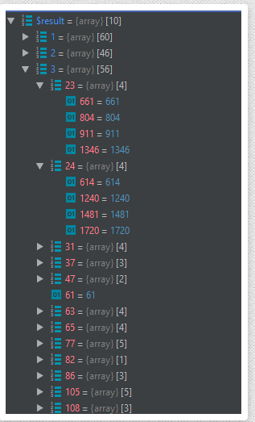

# тестове завдання 2:

## Зробити php скрипт,
який з бази візьме всі категорії https://tests.solomono.net/test_task2/test.sql і побудує дерево наступного виду http://prntscr.com/s52qrv - масив де ключ це id категорії. Якщо є підкатегорії у категорії, то значення - масив з підкатегоріями, якщо немає, то просто дублюється ключ.
Час виконання скрипта не більше 2 сек, запит в базу не повинен бути закешованим.

1. Исходная БД - [dump.sql](dump.sql)
2. Результат - 